# 🐾 Pet Adopt App

## 📋 Overview

Pet Adopt App is a React Native application built using Expo that allows users to browse, add, and adopt pets. The app offers authentication with Clerk, chat messaging, a favorites feature, and seamless navigation using Expo Router. It integrates Firebase Firestore for database management and storage.

## 💻 Technologies Used

- **React Native**: For building the mobile application.
- **Expo**: For streamlined development and testing.
- **Firebase Firestore**: To manage data and storage.
- **Clerk**: For user authentication.
- **React Native Expo Router**: For managing tab-based navigation.
- **React Native Components**: To create and manage the UI.
- **Chat Messaging**: Real-time chat functionality with react-native-gifted-chat.

## 🌟 Features

- **User Authentication**: Users can sign up, log in, and authenticate using Clerk.
- **Tab Navigation**: Smooth navigation between Home, Favorites, Inbox, Profile sections.
- **Pet Management**: Add, view, and manage pets in the system.
- **Favorites**: Users can mark their favorite pets.
- **Chat Messaging**: Real-time chat between users for pet adoption inquiries.
- **Profile Management**: Manage user profile and posts.

## 📱 How to Use

- **Login/Signup**: Users can sign up or log in using their Gmail accounts.
- **Browse Pets**: Browse available pets on the Home screen.
- **Add New Pet**: Add a pet for adoption.
- **Favorites**: Mark pets as favorites and view them in the Favorites tab.
- **Chat**: Chat with pet owners for more information or to arrange adoption.

## 📸 Screenshots

### 1. Get Started Screen

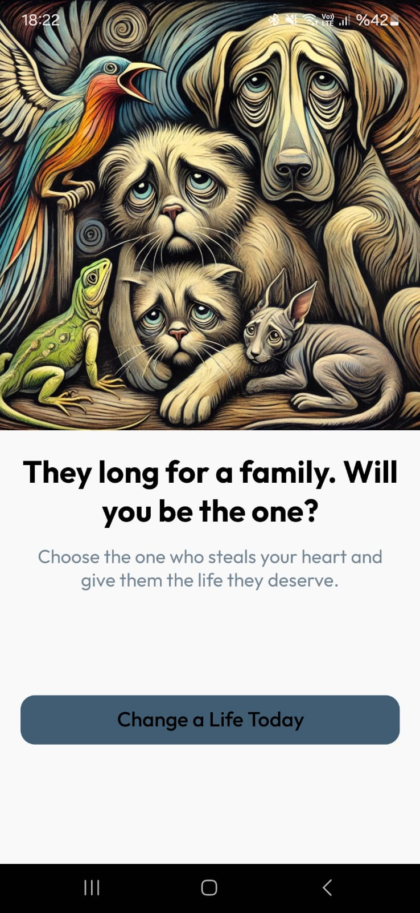

### 2. Auth With Gmail

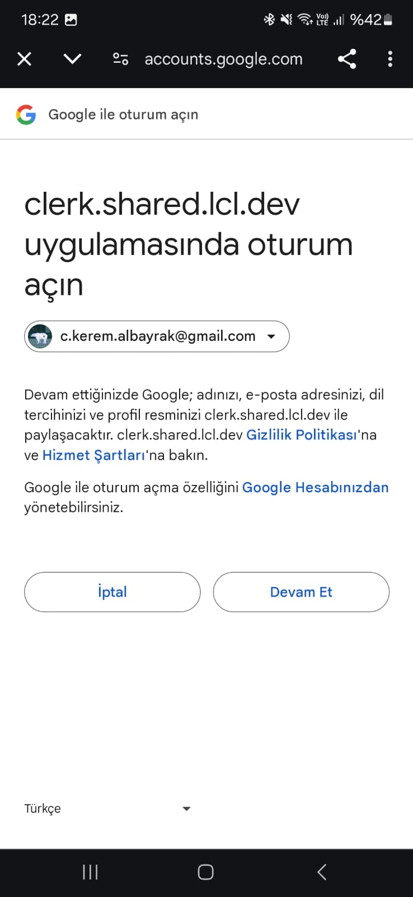

### 3. Home Screen

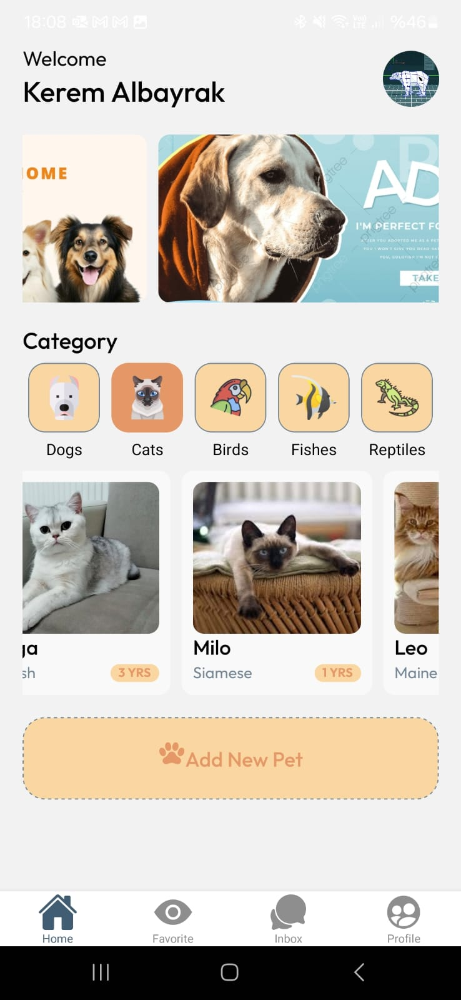

### 4. Home Screen - Birds

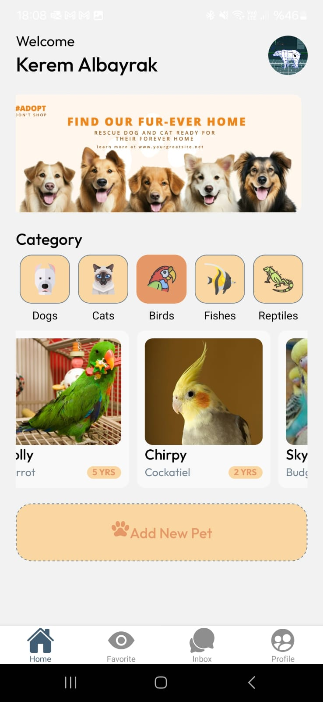

### 5. Home Screen - Cats

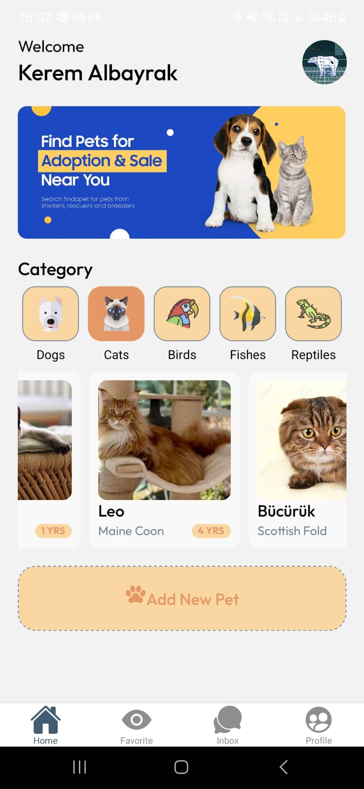

### 6. Pet Info Screen

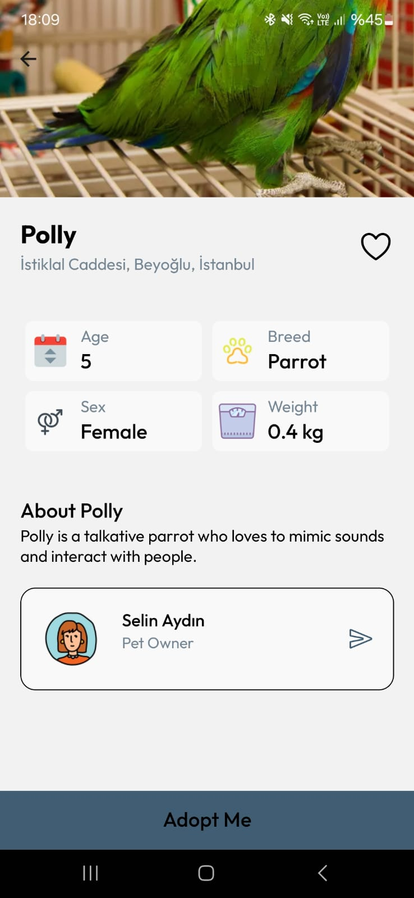

### 7. Pet Info Favorited Screen

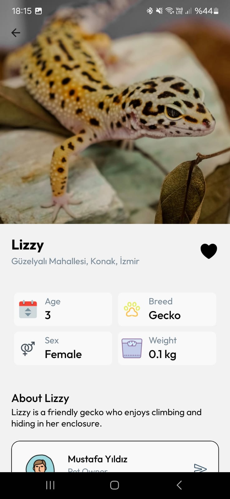

### 8. Favorite Pets Screen

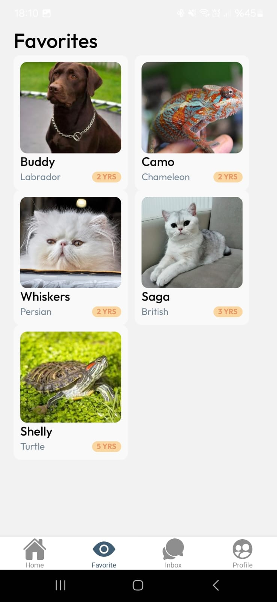

### 9. Add Pet Screen

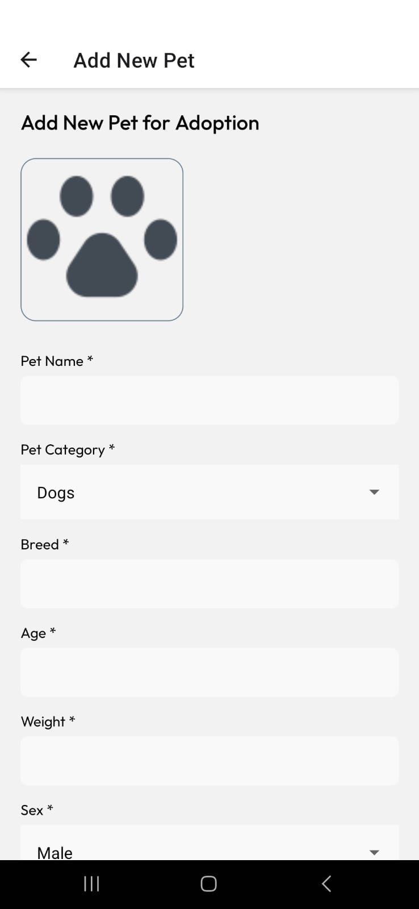

### 10. Add Pet Screen Inputs

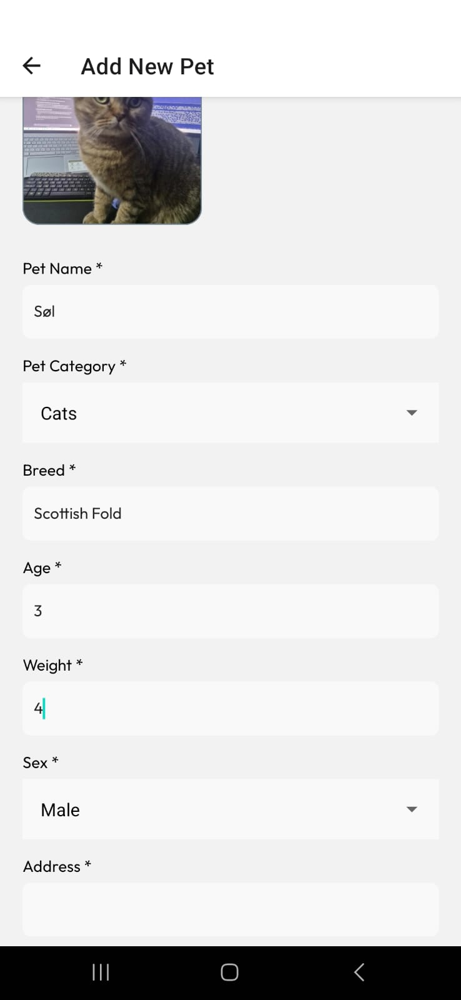

### 11. Inbox Screen

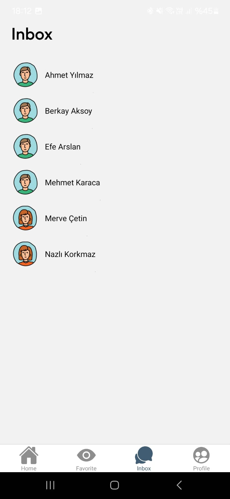

### 12. Chat Screen

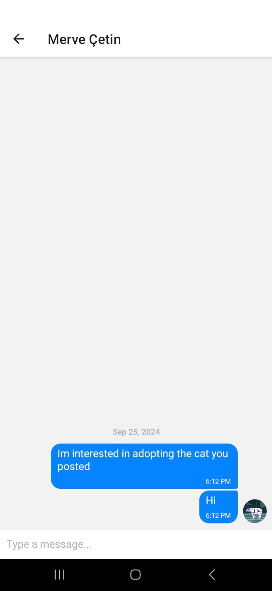

### 13. Profile Screen

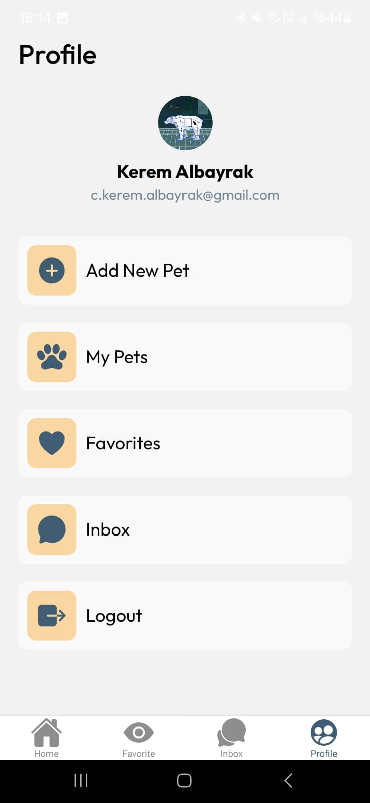

### 14. User Pets - Delete

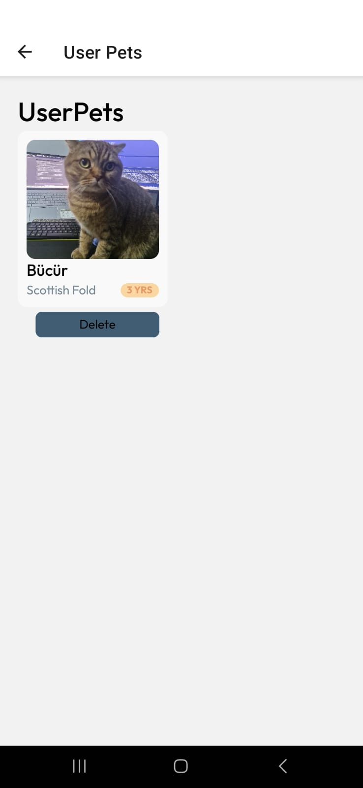
